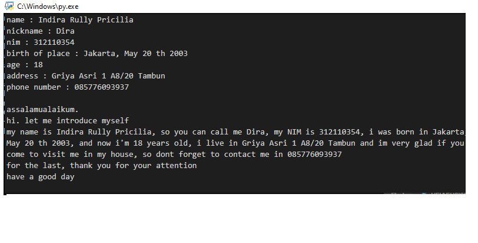
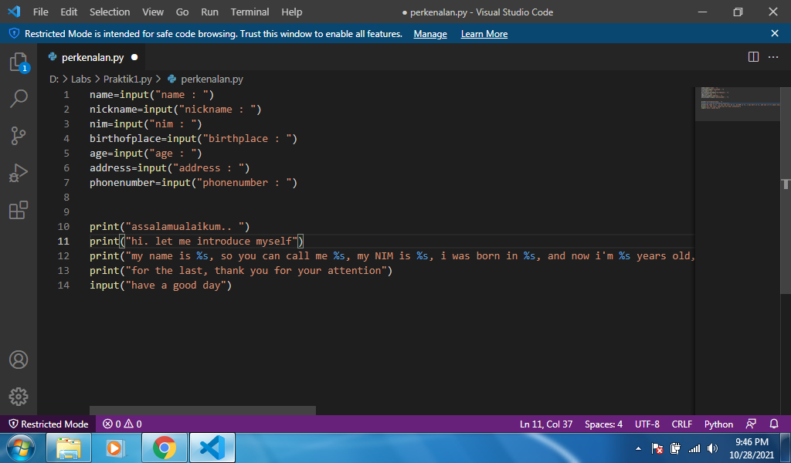
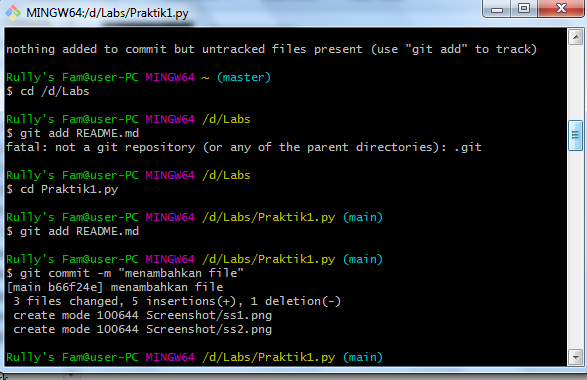

# Praktik1.py
## Belajar menggunakan Python

### Membuat paragraf
Python adalah salah satu bahasa pemograman yang mudah dipelajari.

Berikut ini adalah tampilan python nya

Dan ini pseudocodenya

